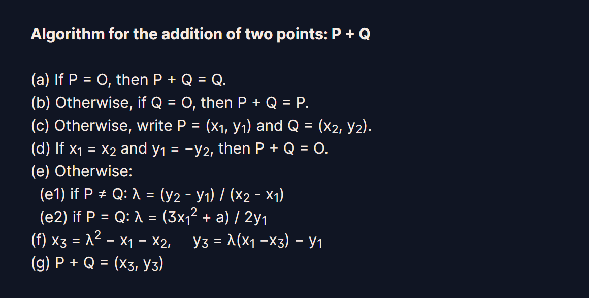

# Elliptic Curve

# Background

Đọc đến cuối cùng, câu hỏi là `Property (d) shows that point addition is commutative. The flag is the name we give groups with a commutative operation.`

```
(a) P + O = O + P = P
(b) P + (−P) = O
(c) (P + Q) + R = P + (Q + R)
(d) P + Q = Q + P
```

đáp án là crypto{abelian}

# Starter

---

### Point Nagetion

Đề cho đường cong Elliptic: 

`E: Y2 = X3 + 497 X + 1768,  p: 9739`

và `P(8045,6936)`, find the point `Q(x,y)` such that `P + Q = O`.

Ta có P + Q = 0 ⇒ Q = -P = (Px, -Py) = (8045, -6936 mod 9739) 

(Theo mình đọc được thì để tính -P thì phải lấy p - Py, mà điều đó tương ứng là -Py mod p)

Đáp án là crypto{8045,2803}

---

### Point Addition

`E: Y2 = X3 + 497 X + 1768, p: 9739`

`P = (493, 5564), Q = (1539, 4742), R = (4403,5202)`

Tìm `S(x,y) = P + P + Q + R`



Cách tính cộng 2 điểm P và Q

Dựa theo algorithm trên, mìn viết code python để tính S

```python
from Crypto.Util.number import inverse

# Curve: E: Y^2 = X^3 + aX + b
p = 9739
a = 497
b = 1768
# E: Y^2 = X^3 + 497X + 1758, p:9739

#Phép cộng hai điểm trong Elliptic Curve
def point_addition(p1,p2):
    lamda = 0
    if p1 == (0,0):
        return p2
    elif p2 == (0,0):
        return p1
    else:
        x1,y1 = p1
        x2,y2 = p2
        if x1==x2 and y1 == -y2:
            return (0,0)
        else:
            if p1 == p2:
                # phép chia sẽ đổi thành nhân với inverse(tmp,p) tất cả mod p
                lamda = ((3*x1*x1 + a) * inverse(2*y1,p) )%p
            else:
                lamda = ((y2 - y1)*inverse(x2-x1,p))%p
    x3 = (lamda*lamda -x1 -x2) % p
    y3= (lamda*(x1-x3) -y1) % p
    return (x3,y3)
def check_add(S):
    YY = pow(S[1],2,p)
    right= (pow(S[0],3,p) + a*S[0] + b)%p
    return YY == right
X = (5274, 2841)
Y = (8669, 740)
#test: print(point_addition(X,Y))
P = (493, 5564)
Q = (1539, 4742)
R = (4403,5202)
S = point_addition(point_addition(point_addition(P,Q),P),R)
print("crypto{" + str(S[0]) + ","+ str(S[1]) +"}")
print(check_add(S))
```

Output: crypto{4215,2162}
True

---

### Scalar Multiplication

Đường cong Elliptic, số p vẫn như cũ.

Với `P = (2339, 2213)` tìm Q(x,y) = 7863*P


Algorithm được mô tả

Code:

```python
#import hàm của câu trước.
from PointAddition import point_addition, a, b, p
# nhân bản vô tính n số P
#input P và n
#output Q

def scalar_multi(P, n):
    Q = P
    R = (0,0)
    while n > 0:
        if n%2 == 1:
            R = point_addition(R,Q)
        Q = point_addition(Q,Q)
        n = n//2
    return R
P = (2339, 2213)
n = 7863

Q=scalar_multi(P,n)
print("crypto{" + str(Q[0]) + ","+ str(Q[1]) +"}")
```

Output: crypto{9467,2742}

---

### Curves and Logs

`E: Y2 = X3 + 497 X + 1768, p: 9739, G: (1804,5368)`

`QA = (815, 3190)`, `nB = 1829`

Theo như ECDSA, thì giữa Alice và Bob khi trao đổi với nhau sẽ làm như sau:

Alice chọn cho mình nA ngẫu nhiên và tính QA= nA.G ( G cho trước)

Bob chọn cho mình nB ngẫu nhiên và tính QB = nB.G

Sau đó trao đổi QA và QB cho nhau, hai người sẽ được một shared secret gọi là S và S= nA.QB (ở phía Alice) = nB.QA (ở phía Bob)

Ở challenge này, giả sử mình là Bob và nhận được QA từ Alice, yêu cầu tìm S và tính hash SHA1 của tọa độ x của S.

Code:

```python
from  ScalarMulti import scalar_multi
import hashlib
from Crypto.Util.number import long_to_bytes as ltb
# E: Y2 = X3 + 497 X + 1768, p: 9739, G: (1804,5368)
a = 479
b = 1768 
p = 9739
G= (1804, 5368)

QA = (815, 3190)
nB = 1829
# Shared secret (S) = nA.QB = nB.QA
S = scalar_multi(QA, nB)
x = str(S[0])
print("crypto{"+ hashlib.sha1(x.encode()).hexdigest()  +"}")
```

Output: crypto{80e5212754a824d3a4aed185ace4f9cac0f908bf}

---

### Efficient Exchange

`Calculate the shared secret after Alice sends you q_x = 4726, with your secret integer nB = 6534.`

Bài này người ta đã cho iv, encrypted_flag và file decrypt, nhiệm vụ của chúng ta là tìm shared secret từ Q_x và nB cho trước.

Với Q_x ta sẽ tìm được 2 Q_y, và sự thật là với hai tọa độ y tìm được từ 1 tọa độ x cho trước thì đều ra shared secret giống nhau.

Để tìm được y từ y^2, đề bài cho một gợi ý là tìm từ `p=3 mod 4` ⇒ p mod 4 = 1, vậy (p+1) mod 4 sẽ là một số nguyên.

```python
from Crypto.Cipher import AES
from Crypto.Util.Padding import pad, unpad
from ScalarMulti import scalar_multi
from Crypto.Util.number import inverse
import hashlib
from math import sqrt

def is_pkcs7_padded(message):
    padding = message[-message[-1]:]
    return all(padding[i] == len(padding) for i in range(0, len(padding)))

def decrypt_flag(shared_secret: int, iv: str, ciphertext: str):
    # Derive AES key from shared secret
    sha1 = hashlib.sha1()
    sha1.update(str(shared_secret).encode('ascii'))
    key = sha1.digest()[:16]
    # Decrypt flag
    ciphertext = bytes.fromhex(ciphertext)
    iv = bytes.fromhex(iv)
    cipher = AES.new(key, AES.MODE_CBC, iv)
    plaintext = cipher.decrypt(ciphertext)

    if is_pkcs7_padded(plaintext):
        return unpad(plaintext, 16).decode('ascii')
    else:
        return plaintext.decode('ascii')

data= {'iv': 'cd9da9f1c60925922377ea952afc212c', 'encrypted_flag': 'febcbe3a3414a730b125931dccf912d2239f3e969c4334d95ed0ec86f6449ad8'}
iv = data["iv"]
ciphertext = data["encrypted_flag"]
#E: Y2 = X3 + 497 X + 1768, p: 9739, G: (1804,5368)
#q_x = 4726, with your secret integer nB = 6534.
# S = nB.QA

Q_x = 4726
nB = 6534
a =497
b = 1768
p = 9739
YY = ((pow(Q_x, 3) + a*Q_x + 1768))
delta = (p+1)//4
Q_y= pow(YY, delta, p)
print(Q_y)
Q = (Q_x, Q_y)
shared_secret = scalar_multi(Q,6534)
print(shared_secret)
# tới đây mình thử shared_secret[0] thì có flag)
print(decrypt_flag(shared_secret[0], iv, ciphertext))
```

# Smooth criminal

Bài này mình đang đóng vai trò là Alice và đang gửi đến Bob flag.

Sau khi đọc source code, tóm tắt bài này như sau:

Alice tạo ngẫu nhiên nA, gửi cho Bob QA và nhận từ Bob QB

Sau đó Alice tình shared secret và tính encrypted flag rồi gửi cho Bob.

Các tham số mà ta có được là: iv, encrypted flag, QA và QB

Để decrypt flag thì cần có shared secret, mà S = nA.QB=nB.QA

Điều ta cần tính là nA, mà lại có QA = nA.G (G đề cho, QA nằm trong file output.txt)

Sau khi mày mò trên mạng thì mình tìm được cách tính n bằng thuật thoán Pohlig-Hellman.


Dùng Sagemath console

Sau khi tìm được n thì decrypt flag.

Full code:

```python
from Crypto.Cipher import AES
import hashlib
from Crypto.Util.Padding import  unpad
from Crypto.Util.number import inverse 
nA= 47836431801801373761601790722388100620
output = {'iv': '07e2628b590095a5e332d397b8a59aa7', 'encrypted_flag': '8220b7c47b36777a737f5ef9caa2814cf20c1c1ef496ec21a9b4833da24a008d0870d3ac3a6ad80065c138a2ed6136af'}
p = 310717010502520989590157367261876774703
a = 2
b = 3
# print(len(output['iv']))
# Generator
g_x = 179210853392303317793440285562762725654
g_y = 105268671499942631758568591033409611165
G = (g_x, g_y)
def point_addition(p1,p2):
    lamda = 0
    if p1 == (0,0):
        return p2
    elif p2 == (0,0):
        return p1
    else:
        x1,y1 = p1
        x2,y2 = p2
        if x1==x2 and y1 == -y2:
            return (0,0)
        else:
            if p1 == p2:
                # phép chia sẽ đổi thành nhân với inverse(tmp,p) tất cả mod p
                lamda = ((3*x1*x1 + a) * inverse(2*y1,p) )%p
            else:
                lamda = ((y2 - y1)*inverse(x2-x1,p))%p
    x3 = (lamda*lamda -x1 -x2) % p
    y3= (lamda*(x1-x3) -y1) % p
    return (x3,y3)
def scalar_multi(P, n):
    Q = P
    R = (0,0)
    while n > 0:
        if n%2 == 1:
            R = point_addition(R,Q)
        Q = point_addition(Q,Q)
        n = n//2
    return R
def gen_shared_secret(Q: tuple, n: int):
    S = scalar_multi(Q, n)
    return S[0]

def decrypt_flag(shared_secret: int, iv: str, encrypted: str):
    sha1 = hashlib.sha1()
    sha1.update(str(shared_secret).encode('ascii'))
    key = sha1.digest()[:16]

    iv = bytes.fromhex(iv)
    encrypted = bytes.fromhex(encrypted)

    cipher = AES.new(key, AES.MODE_CBC, iv)
    plaintext = cipher.decrypt(encrypted)
    return plaintext

b_x = 272640099140026426377756188075937988094
b_y = 51062462309521034358726608268084433317
QB = (b_x, b_y)

# tính secret key
S = gen_shared_secret(QB, nA)
print("Shared secret is")
print(S)
print("FLAG: ")
print(unpad(decrypt_flag(S,output['iv'] ,output['encrypted_flag'] ),16))
```

output:

```python
Shared secret is
171172176587165701252669133307091694084
FLAG:
b'crypto{n07_4ll_curv3s_4r3_s4f3_curv3s}'
```

> Source: [https://hgarrereyn.gitbooks.io/th3g3ntl3man-ctf-writeups/content/2017/picoCTF_2017/problems/cryptography/ECC2/ECC2.html](https://hgarrereyn.gitbooks.io/th3g3ntl3man-ctf-writeups/content/2017/picoCTF_2017/problems/cryptography/ECC2/ECC2.html)
>
